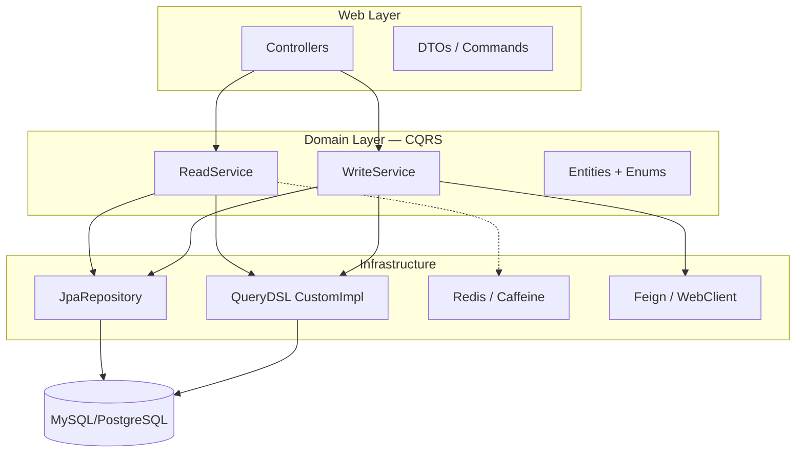
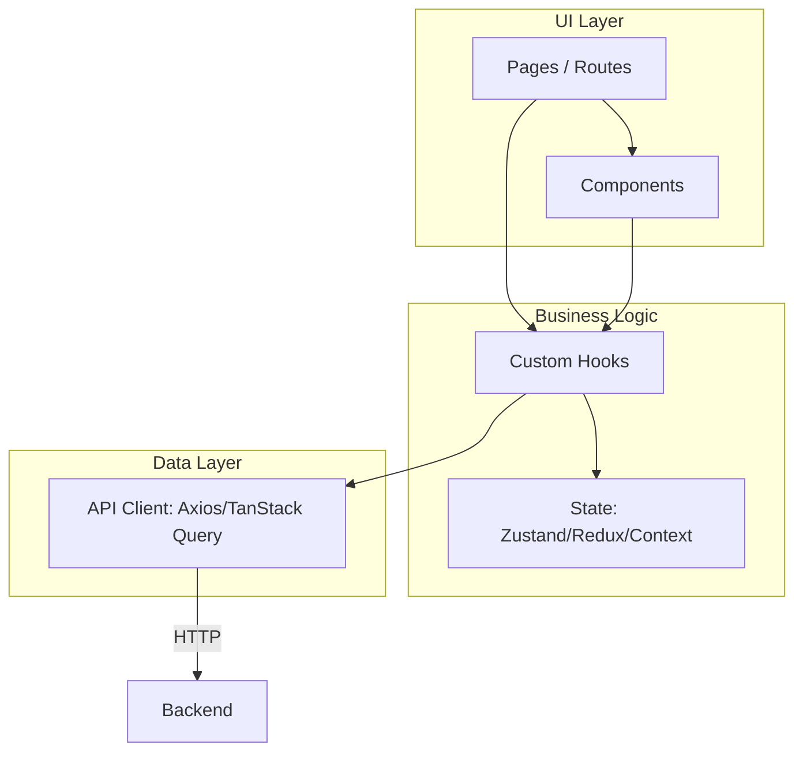
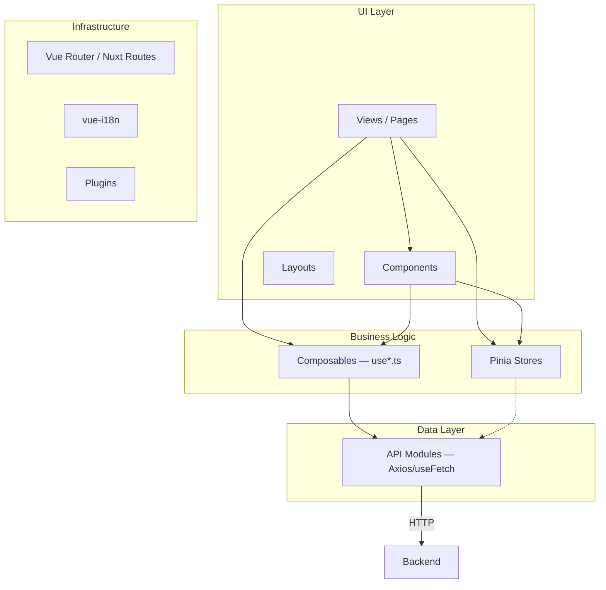
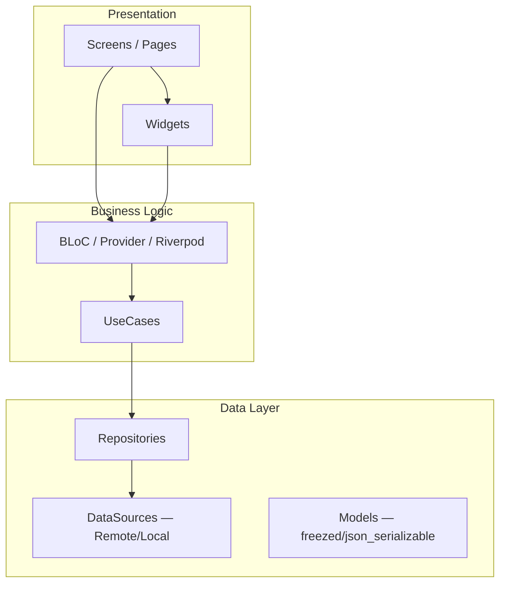
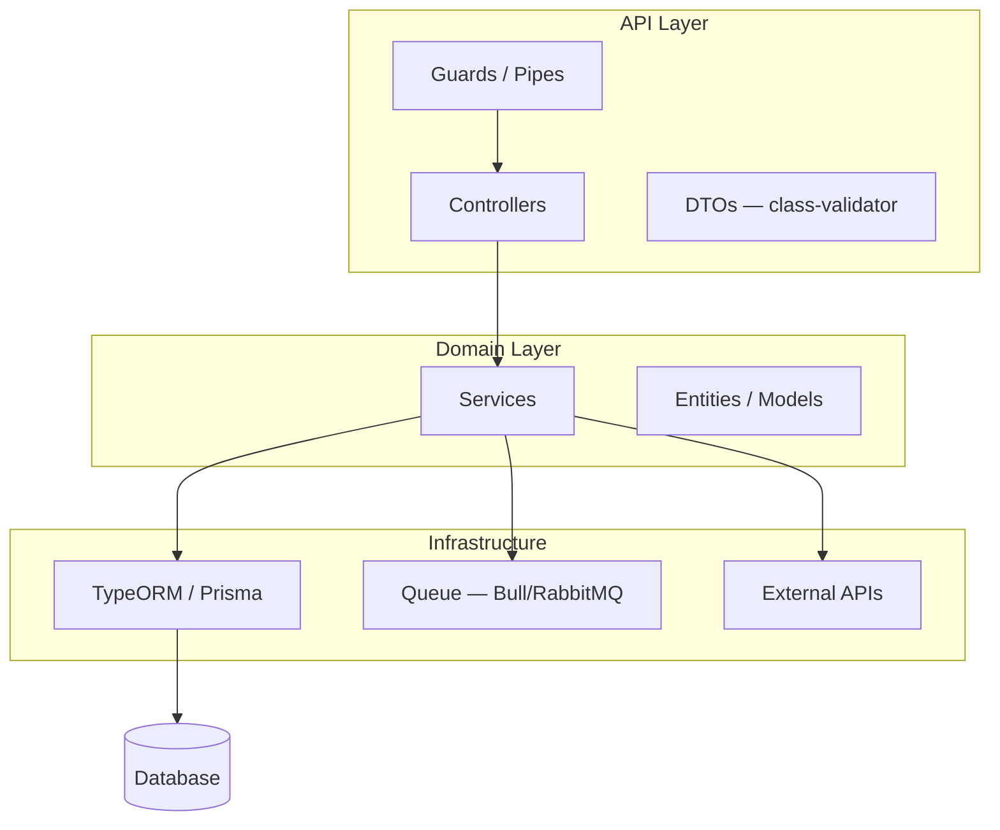

# Organize CLAUDE.md

> **인자**: $ARGUMENTS
> - `(빈 값)` — 전체 재구성 (CLAUDE.md + 참조 문서)
> - `main` — CLAUDE.md만 재구성
> - `references` — 참조 문서만 생성/업데이트
> - `module:<name>` — 특정 모듈의 참조 문서만 (예: `module:repair`)
> - `scan` — 현황 분석만 (변경 없이 리포트)
> - `diff` — 기존 CLAUDE.md vs 제안 변경사항 비교

CLAUDE.md를 **Lazy Loading 참조 구조** + **프레임워크 특화 템플릿** + **Mermaid 아키텍처**로 재구성합니다.

---

## 왜 이 구조가 필요한가

CLAUDE.md는 매 세션 시작 시 전체가 컨텍스트에 로드된다.
- 120줄 이상이면 에이전트가 핵심을 놓치고 지시 compliance가 떨어진다
- 금지형 규칙("NEVER do X")이 권장형("Always prefer Y")보다 compliance가 높다 — 규칙 작성 시 금지형을 우선 사용
- 상세 정보는 `.claude/docs/reference/`에 분리 → 작업 맥락에 따라 lazy loading

---

## Phase 1: 프로젝트 분석

### 1-1. 기존 상태 확인

1. 기존 CLAUDE.md 전체 읽기 (없으면 신규 생성 플래그)
2. 기존 `.claude/docs/reference/` 파일 목록 확인
3. `.gitignore`에서 `.claude/docs/reference/` 차단 여부 확인
4. 기존 `.claude/rules/` 파일 확인

### 1-2. 프레임워크 + 언어 자동 감지

프로젝트 루트에서 아래 파일을 병렬로 스캔하여 **프레임워크 + 언어 조합**을 판별한다.
언어 단독으로 분류하지 않는다 — 항상 프레임워크와 함께 감지한다.

#### JVM 생태계 (Java vs Kotlin 필수 구분)

Spring Boot 등 JVM 프레임워크는 Java와 Kotlin에서 코드 스타일이 완전히 다르다.
잘못 감지하면 Java 프로젝트에 Kotlin data class를, Kotlin 프로젝트에 Lombok 패턴을 추천하게 된다.

**1단계: 프레임워크 감지**

| 감지 방법 | 프레임워크 |
|-----------|-----------|
| `build.gradle(.kts)` + `org.springframework.boot` 플러그인 | **Spring Boot** |
| `pom.xml` + `spring-boot-starter-parent` | **Spring Boot** (Maven) |
| `build.gradle(.kts)` + `io.quarkus` | **Quarkus** |
| `build.gradle(.kts)` + `io.micronaut` | **Micronaut** |

**2단계: 언어 감지 (프레임워크 감지 후 반드시 수행)**

| 감지 방법 | 언어 | 확신도 |
|-----------|------|--------|
| `src/main/kotlin/` 디렉토리 존재 | Kotlin | 높음 |
| `build.gradle.kts`에 `kotlin("jvm")` 또는 `kotlin("plugin.spring")` 플러그인 | Kotlin | 높음 |
| `*.kt` 파일이 `src/` 하위에 존재 | Kotlin | 높음 |
| `src/main/java/` 디렉토리만 존재 + `.kt` 파일 없음 | Java | 높음 |
| Lombok 의존성 (`compileOnly 'org.projectlombok:lombok'`) | Java (Kotlin에서 Lombok 사용 안 함) | 높음 |
| `*.java`와 `*.kt` 파일 모두 존재 | 혼용 — 비율 확인 후 주 언어 결정 | 중간 |

**최종 결과 예시:** `Spring Boot 3.3.8 (Java 21)` 또는 `Spring Boot 3.3.8 (Kotlin 2.0)`

**Java vs Kotlin 핵심 차이 (감지 결과에 따라 적용):**

| 영역 | Java | Kotlin |
|------|------|--------|
| DTO/Entity | Lombok (`@Data`, `@Builder`, `@NoArgsConstructor`) | `data class`, `sealed class`, `value class` |
| DI | `@RequiredArgsConstructor` + `private final` | 주 생성자 주입 (자동) |
| Null 처리 | `@Nullable`, `Optional<T>` | 언어 내장 `?`, `!!`, `?.let {}` |
| 테스트 Mock | Mockito (`when().thenReturn()`) | MockK (`every { } returns`) |
| 비동기 | CompletableFuture, @Async | coroutines (`suspend fun`), Flow |
| 설정 파일 | `build.gradle` (Groovy DSL) | `build.gradle.kts` (Kotlin DSL) |

#### JavaScript/TypeScript 프론트엔드

| 감지 방법 | 스택 |
|-----------|------|
| `package.json` + `react` dep | **React** (+ TS 여부: `tsconfig.json` 존재) |
| `package.json` + `next` dep | **Next.js** (React SSR/SSG) |
| `package.json` + `vue` dep | **Vue** (2 vs 3: `vue` 버전 확인) |
| `package.json` + `nuxt` dep | **Nuxt** (Vue SSR/SSG) |
| `package.json` + `@angular/core` dep | **Angular** |
| `package.json` + `svelte` dep | **Svelte/SvelteKit** |

> TypeScript 여부는 별도 판별: `tsconfig.json` 존재 + `typescript` devDep → TS 프로젝트

#### JavaScript/TypeScript 백엔드

| 감지 방법 | 스택 |
|-----------|------|
| `package.json` + `@nestjs/core` dep | **NestJS** |
| `package.json` + `express` dep (프론트 프레임워크 없음) | **Express** |
| `package.json` + `fastify` dep | **Fastify** |

#### 모바일

| 감지 방법 | 스택 |
|-----------|------|
| `pubspec.yaml` + `flutter` sdk dep | **Flutter** (Dart) |
| `package.json` + `react-native` dep | **React Native** |

#### Python

| 감지 방법 | 스택 |
|-----------|------|
| `requirements.txt`/`pyproject.toml` + `django` | **Django** |
| `requirements.txt`/`pyproject.toml` + `fastapi` | **FastAPI** |
| `requirements.txt`/`pyproject.toml` + `flask` | **Flask** |

#### 기타

| 감지 방법 | 스택 |
|-----------|------|
| `go.mod` + `gin-gonic` / `echo` / `fiber` | **Go + 프레임워크** |
| `Cargo.toml` + `actix-web` / `axum` / `rocket` | **Rust + 프레임워크** |

> 복수 스택 감지 시 → **Monorepo**: 루트 공통 CLAUDE.md + 각 패키지 디렉토리에 하위 CLAUDE.md

### 1-3. 프레임워크별 딥 스캔

감지된 프레임워크에 따라 **실제 코드를 분석**한다 (추측 금지).

#### Spring Boot — Java

```
스캔 항목:
- build.gradle → Spring Boot 버전, Java 버전, 의존성 (JPA, QueryDSL, Redis, Security 등)
- Lombok 사용 패턴 → @Data, @Builder, @RequiredArgsConstructor, @Getter/@Setter
- src/main/java 패키지 구조 → 도메인 모듈 목록
- Entity 클래스 → 상속 관계(BaseEntity), 소프트삭제 패턴, 감사 필드
- Repository → JpaRepository + Custom + CustomImpl 패턴 여부
- Service → CQRS (ReadService/WriteService) 분리 여부 vs 단일 Service
- Controller → Swagger 어노테이션, REST API 패턴, 보안 어노테이션
- application.yml → 프로파일, 캐시 설정, DB 설정, 외부 연동
- 테스트 → JUnit5 + Mockito, @DataJpaTest, @WebMvcTest, @SpringBootTest
- 스케줄러 → @Scheduled, ShedLock 여부
- 외부 연동 → Feign, RestTemplate, WebClient
```

#### Spring Boot — Kotlin

```
스캔 항목:
- build.gradle.kts → kotlin 플러그인 (jvm, spring, jpa, allopen), Spring Boot 버전, Kotlin 버전
- Kotlin 패턴 → data class, sealed class, extension functions, companion object
- coroutines 사용 여부 → kotlinx-coroutines, suspend fun, Flow
- src/main/kotlin 패키지 구조 → 도메인 모듈 목록
- Entity → @Entity + data class 여부, allopen 플러그인 설정
- Repository → JpaRepository + Custom + CustomImpl + Kotlin 확장함수
- Service → coroutine 기반 여부, CQRS 분리 여부
- Controller → @RestController, suspend fun 핸들러
- 테스트 → JUnit5 + MockK, kotest, @DataJpaTest
- Null safety → nullable 타입 활용, ?.let, requireNotNull
```

#### React / Next.js (TypeScript)

```
스캔 항목:
- package.json → scripts, React 버전, TypeScript 여부
- tsconfig.json → paths alias (@ → src/), strict 모드
- Next.js: next.config → App Router vs Pages Router, middleware
- src/ 디렉토리 → pages/app, components, hooks, api, store, types, lib 구조
- 상태관리 → Redux Toolkit / Zustand / Jotai / TanStack Query / SWR
- 스타일링 → CSS Modules / Tailwind / styled-components / Emotion / Vanilla Extract
- API 클라이언트 → Axios 인스턴스 / Fetch wrapper / TanStack Query
- 폼 → React Hook Form / Formik
- 테스트 → Jest / Vitest / React Testing Library / Playwright / Cypress
- 린트 → ESLint 설정 (plugins, extends), Prettier 설정
- 빌드 → Vite / Webpack / Next.js 빌트인
```

#### Vue / Nuxt (TypeScript)

```
스캔 항목:
- package.json → Vue 버전 (2 vs 3), TypeScript 여부
- Vue 3 확인: Composition API (`<script setup>`) vs Options API 사용 비율
  → src/ 내 .vue 파일에서 `<script setup>` 패턴 스캔
- Nuxt: nuxt.config → modules, plugins, 렌더링 모드 (universal/spa)
- vite.config / vue.config → 빌드 설정, alias, 플러그인 (auto-import 등)
- src/ 디렉토리 구조:
  - views/ or pages/ → 페이지 컴포넌트
  - components/ → 재사용 컴포넌트 (global vs local 구분)
  - composables/ → Composition API 추출 로직 (use*.ts 패턴)
  - api/ or services/ → API 호출 모듈 (인스턴스 설정, 인터셉터)
  - stores/ → Pinia 스토어 (defineStore 패턴, setup vs option 스타일)
  - types/ or interfaces/ → TypeScript 타입 정의
  - utils/ or helpers/ → 유틸리티 함수
  - plugins/ → Vue 플러그인 등록
  - layouts/ → 레이아웃 컴포넌트
  - assets/ → 정적 리소스 (CSS 변수, 폰트, 이미지)
  - locales/ or i18n/ → 다국어 메시지 파일
- 상태관리:
  - Vuex (Vue 2) → modules/, getters, mutations, actions 패턴
  - Pinia (Vue 3) → defineStore, storeToRefs 사용 패턴
  - composable 기반 상태 공유 패턴
- 라우팅:
  - Vue Router → routes 구조, 네비게이션 가드, 메타 필드
  - Nuxt → 파일 기반 라우팅, middleware/, definePageMeta
- 스타일링:
  - Scoped CSS (`<style scoped>`) 사용 패턴
  - CSS 변수 (커스텀 프로퍼티) 시스템
  - Tailwind / UnoCSS / WindiCSS
  - SCSS/SASS → 변수, mixin import 패턴
  - CSS Modules (`<style module>`)
- API 통신:
  - Axios → 인스턴스 설정, 인터셉터 (auth, error handling)
  - Nuxt: useFetch / useAsyncData / $fetch(ofetch)
  - 에러 핸들링 패턴 (global error handler, toast 연동)
- i18n:
  - vue-i18n → 메시지 구조, 로케일 전환, lazy loading
  - Nuxt i18n → nuxt.config 설정, useI18n 패턴
- 폼:
  - VeeValidate / FormKit / 수동 validation
  - Zod / Yup 스키마 연동
- 테스트:
  - Vitest → 단위/통합 테스트 설정
  - @vue/test-utils → mount/shallowMount, wrapper API
  - Playwright / Cypress → E2E 설정
  - MSW (Mock Service Worker) → API 모킹
- 린트:
  - ESLint + eslint-plugin-vue 규칙
  - Prettier 설정 (singleQuote, semi 등)
  - auto-import 설정 (unplugin-auto-import, unplugin-vue-components)
```

#### Flutter (Dart)

```
스캔 항목:
- pubspec.yaml → Flutter SDK 버전, 주요 의존성
- lib/ 구조 → Feature-First vs Layer-First 판별
- 상태관리 → BLoC / Provider / Riverpod / GetX 패턴 확인
  - BLoC: Bloc/Cubit 클래스, Event/State 구조
  - Riverpod: Provider 종류 (StateNotifier, AsyncNotifier, Notifier)
  - Provider: ChangeNotifier, MultiProvider 패턴
- 라우팅 → GoRouter / AutoRoute / Navigator 2.0 / GetX routing
- 데이터 레이어:
  - Repository 패턴 여부
  - DataSource 분리 (Remote/Local)
  - Dio / http 패키지 → 인터셉터, 인스턴스 설정
- 모델 → freezed / json_serializable / 수동 직렬화
- DI → get_it / injectable / riverpod 자체 DI
- 테스트:
  - flutter_test → widget test 패턴
  - bloc_test → BLoC 테스트
  - mockito / mocktail → 모킹 패턴
  - integration_test → 통합 테스트
- 린트 → analysis_options.yaml (flutter_lints / very_good_analysis)
- 코드 생성 → build_runner 설정, 생성 대상 (freezed, json, retrofit)
- 에셋 → assets/ 구조, 폰트, 이미지
- 플랫폼별:
  - android/ → minSdk, compileSdk, Gradle 버전
  - ios/ → Podfile, deployment target
```

#### NestJS (TypeScript 백엔드)

```
스캔 항목:
- package.json → NestJS 버전, TypeScript 설정
- src/ 구조 → modules, controllers, services, providers, guards, pipes
- ORM → TypeORM / Prisma / MikroORM / Drizzle
- 인증 → Passport / JWT / Auth guard 패턴
- Swagger → @nestjs/swagger 설정
- 테스트 → Jest, e2e 테스트 설정
- 큐/이벤트 → Bull / RabbitMQ / Kafka
```

---

## Phase 2: 콘텐츠 분류

기존 CLAUDE.md와 스캔 결과를 합쳐서 두 계층으로 분류한다:

### 메인에 남길 것 (Always Loaded)

- 프로젝트 한 줄 설명 + 프레임워크/언어/버전
- Mermaid 아키텍처 다이어그램
- 도메인 모듈 테이블 (해당 시)
- 핵심 명령어 (build/test/run — 코드블록)
- 필수 규칙 3-5개 (금지형 우선)
- Git 컨벤션 (2-3줄)
- 환경 정보 (프로파일, SDK 경로, Swagger/Storybook URL 등)
- Skills 테이블 (있으면 반드시 메인 유지)
- 참조 문서 인덱스 테이블

### 분리할 것 (On Demand → `.claude/docs/reference/`)

**공통:**
- 테스트 전략 (단위/통합/E2E, 커버리지, Mock 패턴)
- 공통 이슈 & 트러블슈팅

**Spring Boot (Java) 참조 문서 후보:**
| 문서 | 참조 시점 |
|------|----------|
| Data Access | Repository/QueryDSL/캐싱/암호화 작업 시 |
| Security & Infra | 인증/인가/외부연동/스케줄러 수정 시 |
| [도메인명] Module | 해당 도메인 코드 수정 시 |

**Spring Boot (Kotlin) 참조 문서 후보:**
| 문서 | 참조 시점 |
|------|----------|
| Kotlin Patterns | data class, coroutines, extension fn 패턴 참조 시 |
| Data Access | Repository/QueryDSL/캐싱 작업 시 |
| Security & Infra | 인증/인가/외부연동 수정 시 |
| [도메인명] Module | 해당 도메인 코드 수정 시 |

**React / Next.js 참조 문서 후보:**
| 문서 | 참조 시점 |
|------|----------|
| Components | 컴포넌트 개발/분리 시 |
| State Management | 상태 관리 로직 작성 시 |
| API Layer | API 호출 작성/수정 시 |
| CSS System | 스타일 작성 시 |
| Routing | 라우트 추가/수정 시 |

**Vue / Nuxt 참조 문서 후보:**
| 문서 | 참조 시점 |
|------|----------|
| Components & SFC | 컴포넌트 개발 시 (SFC 구조, Props/Emits 타입, slot 패턴) |
| Composables | 재사용 로직 추출 시 (use*.ts 네이밍, 반응성 규칙, provide/inject) |
| State Management | Pinia 스토어 작업 시 (defineStore 패턴, storeToRefs, 비동기 액션) |
| API Layer | API 호출 작성/수정 시 (Axios 인스턴스, Nuxt useFetch, 에러 핸들링) |
| CSS System | 스타일 작성 시 (scoped CSS, CSS 변수, Tailwind/UnoCSS, SCSS 패턴) |
| Routing & Navigation | 라우트/가드 수정 시 (Vue Router 구조, Nuxt middleware, 메타 필드) |
| i18n | 다국어 관련 작업 시 (메시지 키 구조, 로케일 전환, 번역 추가) |

**Flutter 참조 문서 후보:**
| 문서 | 참조 시점 |
|------|----------|
| Widgets & Screens | UI 개발 시 (위젯 분리 기준, 재사용 패턴, 성능) |
| State Management | BLoC/Provider/Riverpod 작업 시 |
| Data Layer | API/로컬 저장소/모델 작업 시 |
| Navigation | 라우팅/딥링크 수정 시 |

**NestJS 참조 문서 후보:**
| 문서 | 참조 시점 |
|------|----------|
| Modules & DI | 모듈/프로바이더 추가 시 |
| Database | ORM/마이그레이션 작업 시 |
| Auth & Guards | 인증/인가 수정 시 |

---

## Phase 3: Mermaid 다이어그램 생성

실제 코드 구조를 스캔하여 다이어그램을 생성한다.
반드시 ` ```mermaid ` 코드펜스로 감싼다.
아래는 기본 형태이며, 스캔 결과에 따라 실제 레이어와 컴포넌트를 반영하여 수정한다.

### Spring Boot (Java/Kotlin 공통 — 스캔 결과로 세부 조정)



### React / Next.js



### Vue / Nuxt



### Flutter



### NestJS



---

## Phase 4: 메인 CLAUDE.md 작성

**120줄 이하**로 작성한다. 아래 구조를 기반으로 하되, 프레임워크에 없는 섹션은 생략한다.

```
# CLAUDE.md

## Project Overview
[프레임워크] [버전] ([언어] [버전]) — [프로젝트 한 줄 설명]
- **응답은 한국어로 해주세요** (해당 시)

## Architecture
[Mermaid 아키텍처 다이어그램 — Phase 3에서 생성한 것]

### Domain Modules (해당 시)
| Module | Purpose |
|--------|---------|

## Commands
[코드블록 — 프레임워크에 맞는 빌드/테스트/실행 명령어]

## Key Rules
[3-5개 — 금지형 우선, 가장 중요한 것만]

## Git Conventions (해당 시)
[브랜치/커밋 규칙 — 2-3줄]

## Environment (해당 시)
[프로파일, SDK 경로, URL 등]

## Skills (해당 시)
[스킬 테이블 — 에이전트 트리거 위해 반드시 메인에 유지]

## Reference Docs
작업에 따라 아래 문서를 참조하세요:

| 문서 | 참조 시점 | 경로 |
|------|----------|------|

---
Last Updated: [오늘 날짜]
```

### Key Rules 작성 가이드

규칙은 아래 우선순위로 선별:

1. **위반 시 빌드/런타임 오류** 발생하는 것 (예: Q-class 미생성, 코드 생성 누락)
2. **위반 시 데이터 손실/보안 문제** 생기는 것 (예: 소프트삭제 누락, XSS)
3. **위반 시 성능 문제** 생기는 것 (예: N+1, 불필요한 리렌더링)
4. **팀 컨벤션**으로 반복 위반되는 것

금지형으로 작성:
```
# Spring Boot (Java)
- **NEVER** Entity 수정 후 `clean build` 생략 — Q-class 재생성 필수
- **NEVER** 쿼리에서 소프트삭제 조건 누락 — `DeleteYnPredicates.isNotDeleted()` 사용

# Spring Boot (Kotlin)
- **NEVER** Entity에 data class 사용 — JPA 프록시와 충돌, 일반 class + copy 함수로 대체
- **NEVER** suspend fun 없이 코루틴 서비스 작성 — blocking 코드 혼입 방지

# Vue
- **NEVER** composable 바깥에서 `ref()`를 직접 export — 반응성 소실
- **NEVER** `<script setup>` 없이 Composition API 사용 — SFC 컨벤션 위반

# Flutter
- **NEVER** build() 안에서 비동기 호출 — initState 또는 상태관리 레이어에서 처리
- **NEVER** StatefulWidget 남용 — 상태관리 패키지로 분리
```

---

## Phase 5: 참조 문서 생성/업데이트

`.claude/docs/reference/` 디렉토리에 **기술 중심** 참조 문서를 생성한다.

### 참조 문서 생성 원칙

1. **기술적 사항 우선**: 아키텍처 패턴, 코드 컨벤션, 의존성 관계를 먼저 기술
2. **변경사항 강조**: 프로젝트에서 실제로 변경이 잦은 부분, 실수 발생 패턴을 명시
3. **실제 코드 기반**: 코드에서 패턴을 추출 — 추측하거나 일반론을 쓰지 않음
4. **독립적**: 각 문서는 다른 참조 문서에 의존하지 않아야 함
5. **언어 일치**: Java 프로젝트 문서에 Kotlin 예시를 넣거나 그 반대를 하지 않음

### 참조 문서 템플릿

```markdown
# [제목]

> 참조 시점: [어떤 작업을 할 때 이 문서를 읽으세요]

## 개요
[해당 영역의 핵심 구조와 기술적 결정 사항]

## 아키텍처
[Mermaid 다이어그램 또는 계층 구조]

## 핵심 패턴
[이 영역에서 반복적으로 사용되는 코드 패턴 — 실제 코드에서 추출한 예시]

## 의존성 & 관계
[다른 모듈/레이어와의 관계, 주입 방식, import 경로]

## 변경 시 주의사항
[이 영역 수정 시 함께 확인해야 할 것들]
[과거 발생한 문제 패턴, 자주 실수하는 포인트]
```

### 작성 규칙

- 문서당 **200줄 이하**
- 코드 예시는 실제 프로젝트 패턴 반영 (일반 예시 금지)
- 기존 참조 문서가 있으면 **덮어쓰지 않고 병합** (기존 + 새 발견 사항)
- `.claude/docs/reference/`는 git에 커밋 (에이전트 접근 보장)

---

## Phase 6: 실행 전 확인

**사용자에게 변경 계획을 보여주고 확인 받은 후에만 실행한다.**

표시할 내용:
1. 감지된 프레임워크 + 언어 조합 (예: `Spring Boot 3.3.8 (Java 21)`)
2. 메인 CLAUDE.md 변경 요약 (추가/이동/유지 항목)
3. 생성/업데이트할 참조 문서 목록
4. `scan` 인자 시: 리포트만 출력하고 종료
5. `diff` 인자 시: 현재 vs 제안 차이점만 보여주고 종료

---

## Phase 7: 검증

- [ ] 메인 CLAUDE.md가 **120줄 이하**인지 확인
- [ ] 기존 정보가 100% 메인 또는 참조 문서에 보존되었는지 확인
- [ ] 참조 테이블의 경로가 실제 파일과 일치하는지 확인
- [ ] Mermaid 다이어그램이 실제 코드 구조를 반영하는지 확인
- [ ] 빌드/테스트 명령어가 정확한지 확인 (빌드 설정 파일 대조)
- [ ] `.claude/docs/reference/`가 `.gitignore`에 포함되지 않았는지 확인
- [ ] Skills 섹션이 있으면 메인에 유지되었는지 확인
- [ ] Key Rules가 금지형 우선으로 작성되었는지 확인
- [ ] Java/Kotlin 언어가 정확히 반영되었는지 확인 (코드 예시, 패턴, 도구)
- [ ] 줄 수 리포트 출력: `CLAUDE.md: N줄, 참조문서: M개`

---

## 핵심 주의사항

- 기존 CLAUDE.md의 정보를 **절대 삭제하지 않음** — 메인 또는 참조 문서로 반드시 이동
- 기존 `.claude/docs/reference/`가 있으면 **덮어쓰지 않고 병합**
- Skills 섹션은 메인 CLAUDE.md에 유지 (에이전트가 스킬 트리거 위해 항상 봐야 함)
- Screenshots, Notes 등 운영 관련 섹션도 메인에 유지
- 모노레포: 루트 CLAUDE.md (공통 규칙) + 각 패키지 디렉토리에 하위 CLAUDE.md (패키지 전용, lazy loaded)
- `module:<name>` 인자 사용 시: 해당 모듈만 딥 스캔 후 참조 문서 1개 생성/업데이트
- Java/Kotlin 혼동 금지: 감지된 언어에 맞는 패턴만 적용 (Lombok ↔ data class 혼용 불가)
